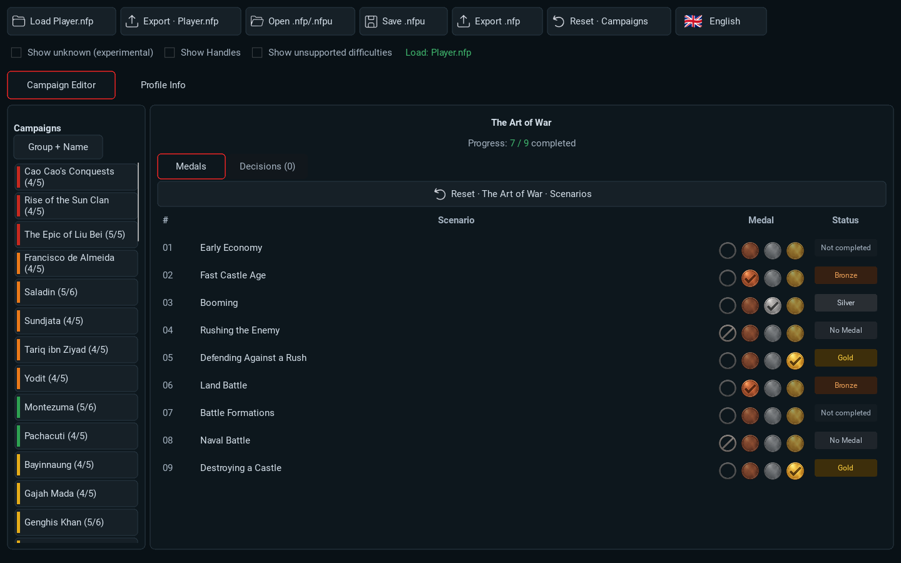
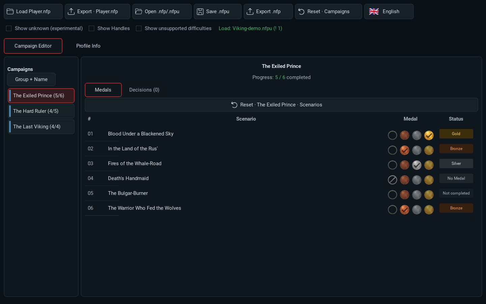
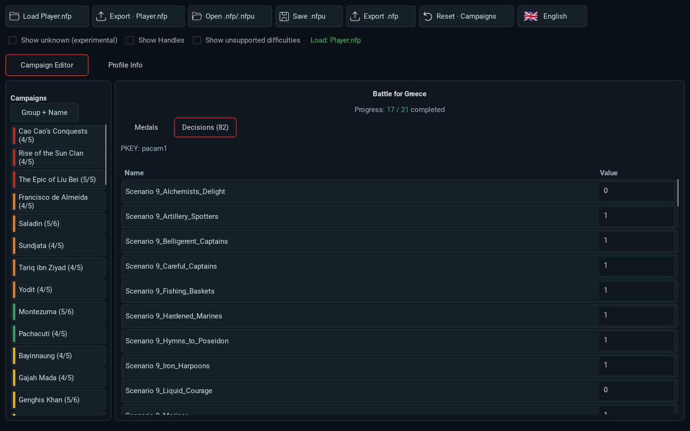
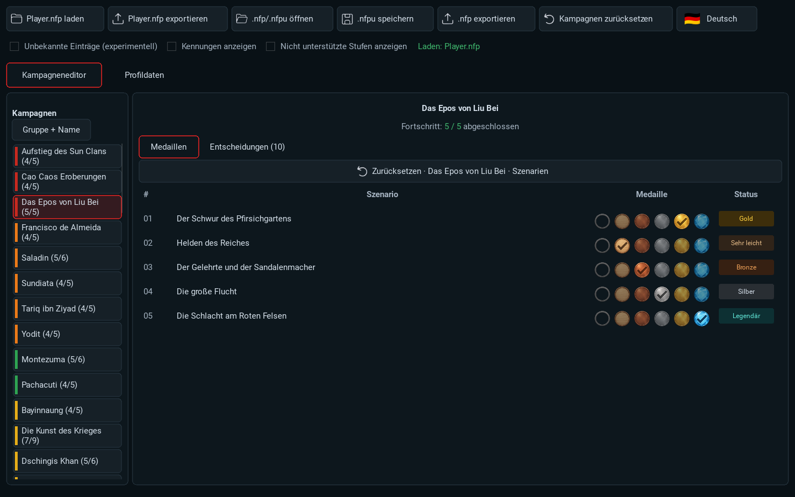
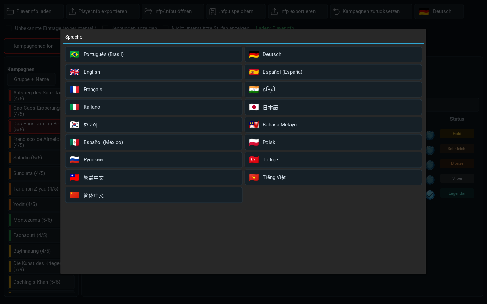
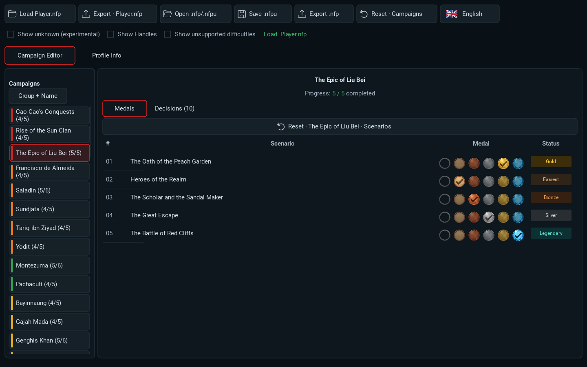
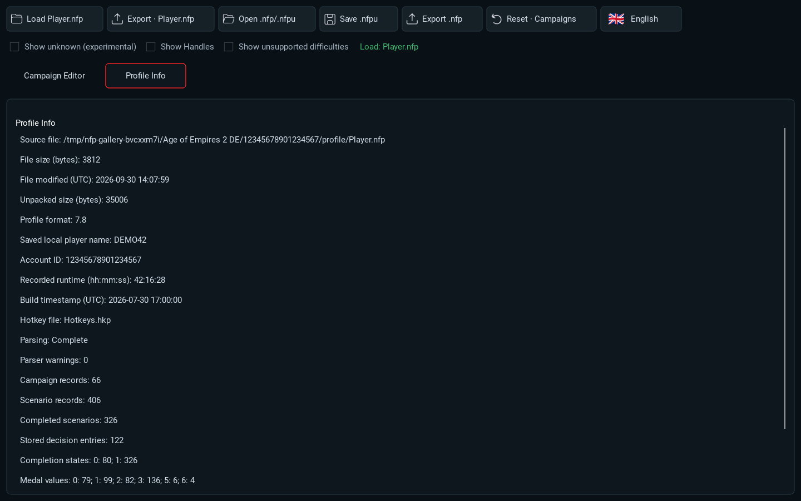

# NFP Editor

**Inspect, repair and edit your Age of Empires II: DE campaign progress without manually touching `Player.nfp`.**

[Download for Windows or Linux](https://github.com/cmsautter/NFP-Editor/releases/latest) · [Report a bug](https://github.com/cmsautter/NFP-Editor/issues)

An unofficial visual editor for Windows and Linux. Open a profile, review its progress, and make changes through the interface.

## What you can do

* Inspect campaign and scenario progress, edit recorded medals, and repair lost completions.
* Change recorded campaign decisions to explore other paths or outcomes with less replaying.
* Open the game's `Player.nfp` directly or choose a separate `.nfp` / `.nfpu` file.
* Save an edited copy or export directly to the game profile, with an automatic numbered backup.
* Inspect **Profile Info**: saved player name when available, profile folder account ID, progress totals, recorded runtime, and file details.
* Choose from the game's **17 languages**. Editor controls have bundled translations; campaign and scenario names use your local game files. Editing works without a game installation, with English campaign and scenario names.

### Explore different campaign decisions

Want to experience a campaign with different choices? Where a campaign uses decisions saved in your profile, changing an existing choice can let you revisit the affected scenarios with another path or outcome, without replaying all the earlier missions just to reach that decision.

The **Decisions** tab shows the choices already stored for the selected campaign. The available entries and their effects depend on the campaign. Keep a separate profile copy for experimenting and check the result in the game.

## Why this tool exists

The project began in 2025 as a small repair script, helping players whose earned medals had been downgraded or disappeared after an update. It grew out of the [campaign medal bug discussion](https://forums.ageofempires.com/t/bug-all-gold-medals-replaced-with-silver-medals/272661).

Players also reported losing **Victors and Vanquished** and **The Mountain Royals / Caucasus** progress after reinstalling. Their reports described completions that were not restored from the server copy, particularly painful after long, demanding scenarios. A developer reported that issue fixed on **30 April 2026**. [Campaign reset discussion](https://forums.ageofempires.com/t/caucasus-and-victors-and-vanquished-campaigns-reset-upon-reinstall/267980)

Repairing lost progress remains the original purpose. The tool has since grown into a visual editor for inspecting profiles and editing existing campaign choices as well. I wanted to give it a proper home, with downloads, documentation, and a place for feedback.

This is a community tool, unaffiliated with the game developers.

## What's new in Alpha 4

* The three **Viking Sagas** chapters: **The Exiled Prince**, **The Hard Ruler**, and **The Last Viking**.
* Language selection and localized campaign and scenario names across all **17 supported languages**.
* Campaign decision editing to explore alternative recorded choices with less replaying, plus the read-only Profile Info page.
* Clearer medal buttons: inactive faces are blank and subdued; the selected medal is bright and checked. **Easiest** uses a wooden medal. Easiest and Legendary choices appear where campaign support is known.
* Corrected scenario labels in **The Art of War**, **Victors and Vanquished**, and **Historical Battles**, plus updated English titles elsewhere.
* More reliable profile loading, responsive medal selection, improved sorting, and sharper text throughout the interface.

See the [Alpha 4 release notes](ALPHA4_RELEASE_NOTES.md) for details.

## Important limits

**Lowering medals or resetting progress:** Relic's servers may keep a higher completion record and restore it when the game goes online. A local reset does not clear that server record. Lowered medals may work offline, but this is not a dependable way to start a fresh playthrough.

**Cheating or awarding yourself unearned medals:** not recommended. Increased medals may synchronize to Relic's servers and stay there. Treat those increases as irreversible for the account: the editor cannot undo a stored server increase, and restoring a local backup will not remove it. You could be left seeing medals you never earned.

These limits also matter during a legitimate repair. Set each affected scenario to the completion you actually achieved, and keep a separate backup before editing. Steam Cloud may replace a locally edited profile.

Standard campaigns offer no medal, Bronze, Silver, and Gold. **Show unsupported difficulties** can expose Easiest and Legendary for other campaigns after a warning. Unsupported values may show no medal or cause unpredictable behaviour, including crashes. Enable this only if you understand the risk.

The editor changes recorded profile progress. It does not change a scenario's rules or in-game difficulty menu.

## Getting started

1. **Close the game and keep a separate backup of `Player.nfp`.**
2. Use **Load Player.nfp** to find your game profile, or **Open .nfp/.nfpu** to select another file.
3. Check the affected campaign and scenario, then choose the completion and medal you actually earned.
4. Export a separate `.nfp`, save an `.nfpu`, or use **Export → Player.nfp** to write to the selected game profile. Direct export creates a numbered `.bak` backup first.
5. Start the game and check the repair. If testing lowered medals or a local reset, keep the game offline.

## Alpha 4 in pictures

Click an image to view it at full size. Screenshots use sample progress and fictional identity details.

| Viking Sagas | Campaign decisions |
| --- | --- |
|  |  |
| Three new campaign chapters. | Explore other recorded choices with less replaying. |

| Localized campaigns and scenarios | Language selection |
| --- | --- |
|  |  |
| Game titles and editor controls in any of the 17 supported languages. | Native language names and flags. |

| Medal controls | Profile Info |
| --- | --- |
|  |  |
| Only the selected tier is checked. | Inspect saved identity, progress, and runtime. |

## Languages and compatibility

Supported languages: Brazilian Portuguese, German, English, European Spanish, French, Hindi, Italian, Japanese, Korean, Malay, Mexican Spanish, Polish, Russian, Turkish, Traditional Chinese, Vietnamese, and Simplified Chinese.

Editor translations are drafts. Localized campaign and scenario names require game language files; missing titles fall back to English. Steam installations are detected automatically where possible. If needed, set `AOE2DE_INSTALL` to your game installation directory.

**Future game updates, new campaigns, or changes to the profile format may require an NFP Editor update.** Alpha 4 can recover campaign progress even when some unrelated sections are not recognized, but check that the loaded names and medals are correct before exporting. If anything looks wrong, [report the issue](https://github.com/cmsautter/NFP-Editor/issues), including the game version and affected campaign/scenario.

Saved player names may reflect an earlier session, and the runtime recorded in the profile may differ from Steam's total playtime.

## Download and support

The Windows and Linux builds are standalone 64 bit applications; no Python installation is needed. Run the `.exe` on Windows. On Linux, allow the downloaded file to execute in its file properties, then launch it.

* [Latest release](https://github.com/cmsautter/NFP-Editor/releases/latest)
* [GitHub project](https://github.com/cmsautter/NFP-Editor)
* [Bug reports](https://github.com/cmsautter/NFP-Editor/issues)

A source code release is planned so players can inspect how their profiles are read and changed. [Asset licenses and attribution](LANGUAGE_FLAGS_ATTRIBUTION.md) cover the bundled flags and fonts.
